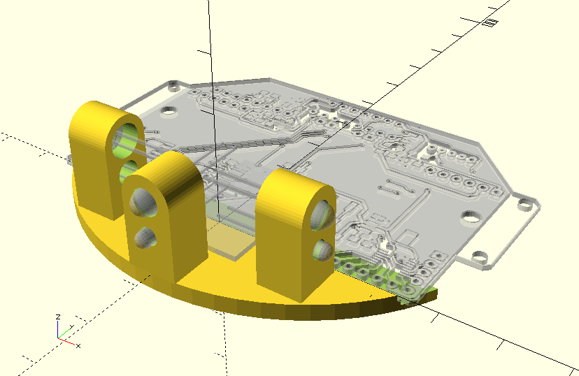
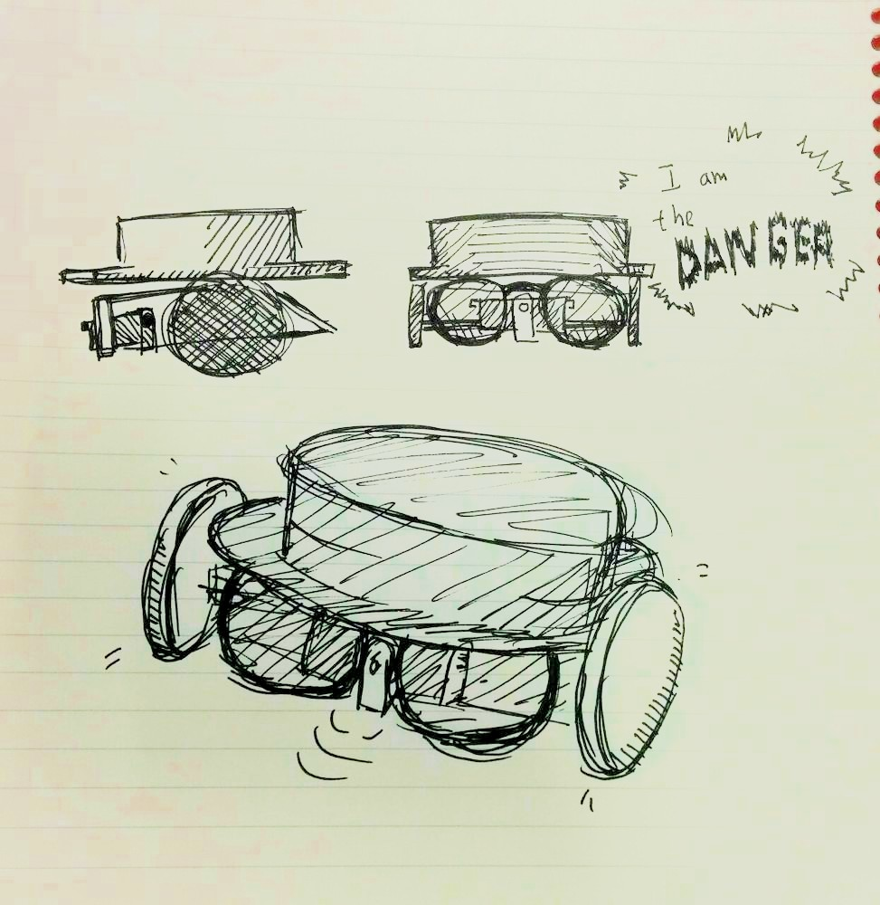

IR sensor holder for maze-solving with ESP-Multi-Board
=

Holds a *SFH4545* (photo-diode) infrared emmiter and a *TEFT4300* (photo-transistor) receiver

License: CC-BY-SA 4.0 (Attribution-ShareAlike 4.0 International, <http://creativecommons.org/licenses/by-sa/4.0/>)
Designed with <http://www.openscad.org/>

# What could have been

Boceto de Guillermo Sarasa (@Arphunix) para el robot que finalmente fue bautizado como _DELS (¿Dónde Está La Salida?)_ por Pablo Molins (@molins).
